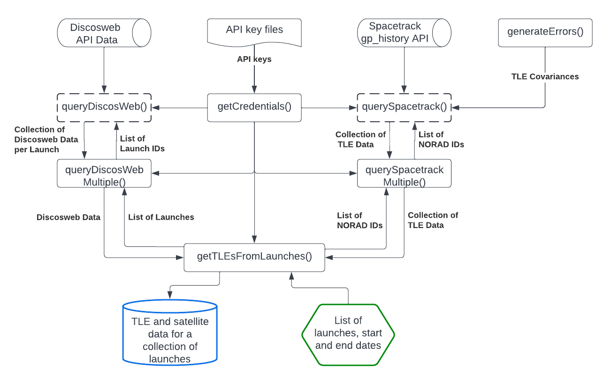

# Small Space Object Tracking
Space Debris Radar Tracking Capabilities assessment | Microsat Engineering project
## Original Repository.
The core functioning of this software was developed in collaboration with other 

## Setup
The tool requires spacetrack log in credentials obtained from https://www.space-track.org/.
#### 1. Retrieve the repository through git:
```
git clone git@github.com:tristandijkstra/SmallObjectTracking.git
```
#### 2. Add API keys
Add a keys folder with two keys files with names discosweb.txt and spacetrack.txt:
```
SmallObjectTracking
├───data
├───extract
├───keys
│   ├───discosweb.txt
│   └───spacetrack.txt
.
```
spacetrack.txt:
```
username
password
```
discosweb.txt:
```
API_KEY
```
#### 3. Install prerequisite Python libraries
The project has been developed and tested for python 3.9+. An environment can be created using conda:
```
conda config --add channels conda-forge
conda config --set channel_priority strict
conda env create -f requirements.yaml
```
or optionally through pip (not tested):
```
pip install requirements.txt
```

## Features

The package's main functions are shown above. Dashed functions cache the data they collect for faster successive retrieval. Each of the functions contain extensive docstring documentation that details their functioning. Notably, the getTLEsFromLaunches() function allows the user to select many different output methods, some are listed in the example section below. While all functions can be used standalone, the some functioning is only found in getTLEsFromLaunches().

The project's report contains information about the data retrieved.
## Example
```py
from extract.extract import getTLEsFromLaunches, getCredentials
from datetime import datetime

start = datetime(2022, 1, 1)
end = datetime(2023, 1, 1)

token = getCredentials(source="discos")
username, password = getCredentials(source="spacetrack")

launchIDs = ["2013-066", "2018-092", "2019-084", "2022-002"]

# standard method, with combined TLEs
discosDataDict, launchesTLEDict = getTLEsFromLaunches(
    username,
    password,
    token,
    launchIDs,
    start,
    end,
    combineDiscosAndTLE=True,
    collectLaunches=False,
    forceRegen=False,
)

print(launchesTLEDict["2013-066"][39416])

# combining everything into one DF
discosDataDict, df = getTLEsFromLaunches(
    username,
    password,
    token,
    launchIDs,
    start,
    end,
    combineDiscosAndTLE=True,
    collectLaunches=True,
    collectAllTLEs=True,
    forceRegen=False,
)

print(df)
```